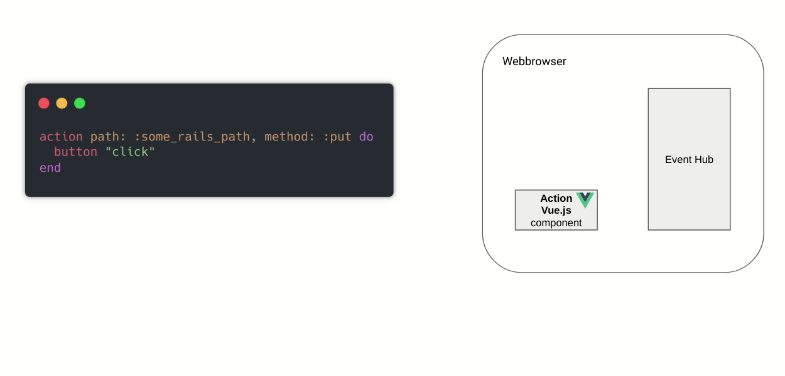
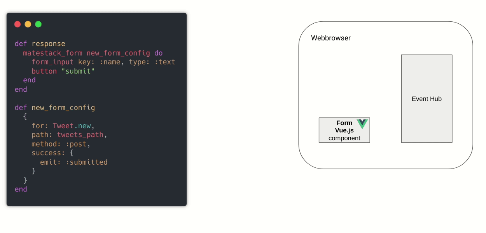
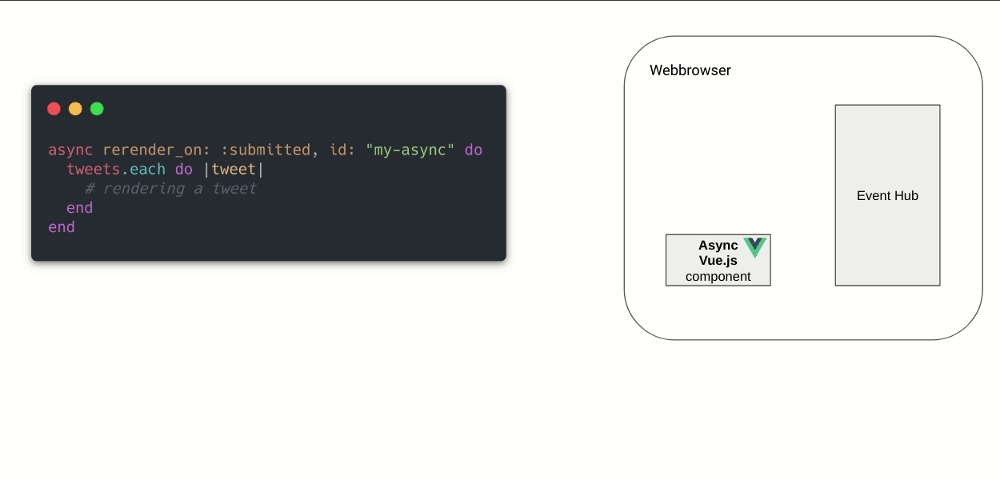
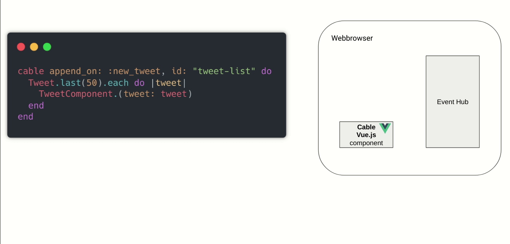
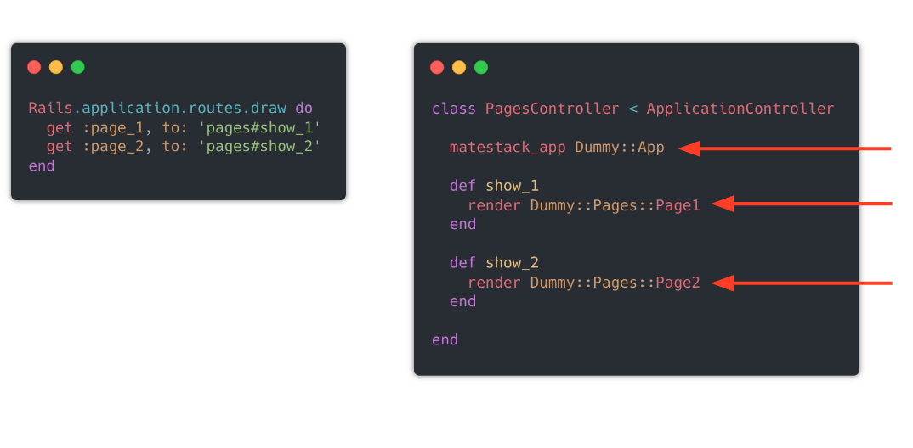
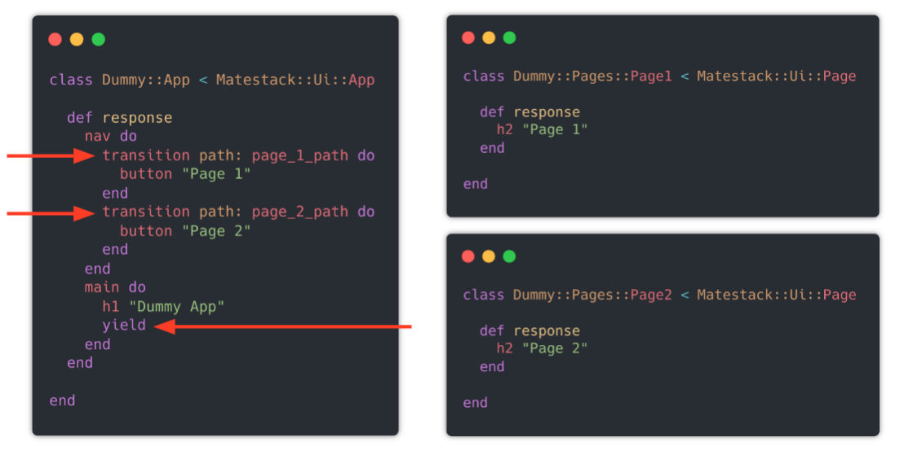
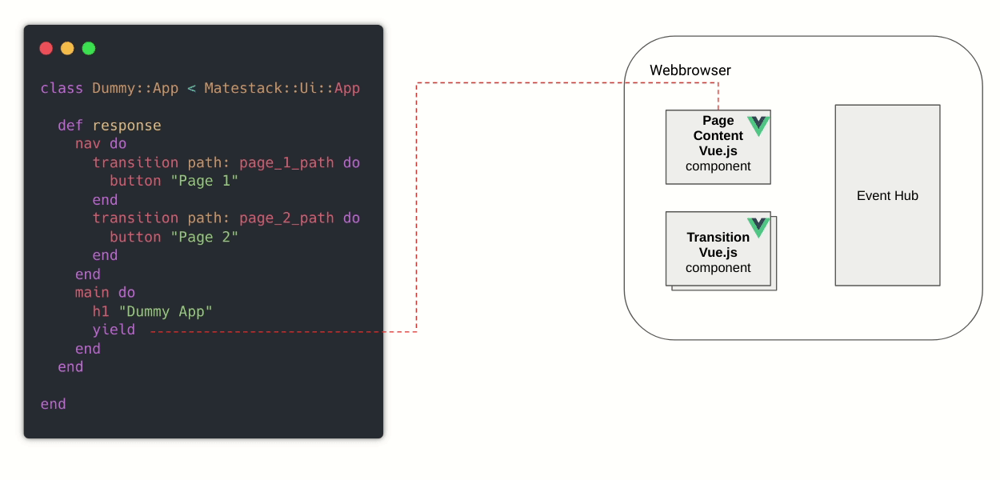

# Overview

90 % of required reactivity in a typical web app is based on similar patterns:

* Dynamic page transitions
* Dynamic form submissions and server side validation display
* Dynamically calling server side action
* Partial UI updates without browser reload
* View state toggling on user interactions
* Syncing multiple clients and let the react to server side events
* ...

Why reimplementing these generic features in JavaScript all the time? Why not build and maintain these features once and reuse them across all your apps? Can you imagine how much JavaScript implementation and maintenance can be avoided this way? Wouldn't that be cool?

Well, `matestack-ui-core` ships a growing library of pre-built reactive components implemented with Vue.js serving exactly that purpose: Enable you to skip the JavaScript implementation and focus on real Ruby business logic implementation!

**Let's review the basic principles using the simplest two of these pre-built reactive components and toggle the view state on client side events using the `toggle` and `onclick` component:**

Imagine this simple use case: You want to click somewhere on the UI and want to toggle the view state somewhere else on the UI. In a Matestack class response, you just call Ruby methods like `onclick` and `toggle` and pass in required options like `emit: :hello` or `show_on: :hello` and a block like `button 'click me'` or `span ...`‌

These methods are calling the pre-built reactive core components which are associated with a Vue.js JavaScript counterpart. The response method of a component or page class returns an HTML string. Each Vue.js component reference, in this case `onclick` and `toggle` triggers the rendering of  a special HTML `<component>` tag containing the configuration hash as tag attributes \(e.g `emit: hello`\) and the given block as the inner HTML \(e.g. `button 'click me'`\)

When this HTML is parsed by Vue.js in the browser, the referenced Vue.js components, which are included in Matestack’s JavaScript are mounted and get the configuration hash injected. The inner HTML is treated as the components template. We then have two Vue.js component up and running in the browser! Additionally an event hub is mounted which enables communication between all components.

In the above shown example we defined an UI which will show a button and when that button is clicked the event “hello” is emitted and then received from the `toggle` component which will show its content, in this case a span containing a string “hello world”.

Thanks to specific configurations and specific blocks you can adjust the behavior and the look of the pre-built reactive components according to your needs. 

Learn more:





### Calling server side controller actions using the `action` component

The `action` component is designed to call server side Rails controller actions from the web browser. Within your Ruby response of a page or component, you simply call the `action` component and configure it with a hash containing the rails controller action path and the desired HTTP method. Additionally you’re telling the action component to show a simple button with you specific block:

When this button is clicked, the `action` Vue.js component performs a background HTTP PUT request towards the specified path, targeting a Rails controller action. The response of this controller action may be used to emit events to the event hub, triggering a `toggle` component to show a success message for example. \(fyi: we're not doing this in the above shown example, see next example\)



### Submit user input to Rails controller actions using the `matestack_form` component

In the below shown example we’re calling the `matestack_form` component and pass in a configuration hash. This time we’re using a helper method as the configuration hash is a bit longer but we want to keep a clean UI implementation. We’re telling the form component to collect user input, in this case via an text input and when submitted, perform a background HTTP POST request containing this user input towards the specified Rails controller action:

The controller action does its thing and may react with a positive or negative status code.  A negative response usually will contain server validation messages for example coming from ActiveRecord validations. These errors are received from the `form` Vue.js component in the browser and then rendered next to the relevant form input fields.

In our example we configured the form component to emit an event “submitted” when the form was submitted successfully. If the Rails controller action responds with a positive status code, the form component emits the event to event hub, which can be received by other Vue.js components in the browser.



### Partial UI updates on client/server side events using the `async` component

The `async` component is designed to perform a partial UI update, requesting fresh content from the server. In the below shown example, we configure an `async` component to rerender itself on a event coming from a `matestack_form` component:

When the form was successfully submitted, it emits the event “submitted” which then is received by the `async` Vue.js component. The `async` component then performs a background HTTP request towards a Rails controller action. The controller action rerenders the UI on the server side and just sends back the relevant part of the HTML to the a`sync` component in the browser. The component can now perform a DOM Update, rendering the fresh HTML just sent from the server!

Want some extra sugar? `async` doesn’t care where the event is coming from! Thanks to a super simple ActionCable integration, events can be broadcasted from the server to all connected web clients and there passed through to Matestack's event hub!

And then the `async` components on all connected web clients are doing their thing:

### Partial UI updates pushed via ActionCable using the `cable` component

If you’re into optimising the partial UI update mechanism, you can use Matestacks `cable` component. The `cable` component in this example is configured to append something on an event called “new\_tweet”

Now we use the ActionCable integration to not only push a simple event to Matestack's event hub, but render a specific component \(in this example the custom `TweetComponent` rendering only one Tweet\) on the server and push  this specific HTML to all connected web clients:

The cable component in the browser receives the event and the rendered HTML and will append this HTML to the current DOM.

This approach is way more fine tuned compared to the simple rerendering mechanism of the `async` component! But it requires a bit more implementation effort: For simple use cases, the `async` component serves you very well. If you need to take care of computation time and scalability towards higher traffic, use the `cable` component!



### Dynamic page transitions using the `transition` component

`transition` components enabling dynamic transitions from one page to another without a full browser page reload. Well, you need at least two pages for that to work! Let’s define them:

Two rails routes targeting two Rails controller actions, each responding with a different Matestack page. But wait! there’s  something else. We tell the controller to wrap all page responses in a **Matestack app**. 

A Matestack **app** is therefore something like a Rails layout. Like a Rails layout yields Rails views, a Matestack **app** yields Matestack pages!

An **app** may look like this:

Just like Matestack pages and components, we define a Ruby class and a response method. In there, we’re defining a navigation on top, calling two `transition` components with different paths, targeting the Rails controller actions we just saw. Finally we're telling the **app** where to yield pages.

On a initial request, the requested page and it’s **app** will be rendered together and shipped to the web browser. Vue.js automatically mounts a page content Vue.js component on the spot, we’re we told the app to yield pages:

When we click on a `transition` Vue.js component, the `transition` will trigger a background HTTP GET request towards the desired Rails controller action which will only respond with the HTML string generated from the response of the desired Matestack page

This HTML is than shipped back to the browser and will be picked up by the `page content` Vue.js component which than switches the current page with the new one coming from the server! The rest of the layout stays untouched!



### Rendering reactive data sets using the `collection` component

The `collection` component displays ActiveRecord models or similar collections and add features like reactive filtering, paginating and ordering with ease. Each of these features requires no page reload to take effect, because the `collection` component leverages a `async` component in combination with the event hub to only reload the relevant content of the collection. 



