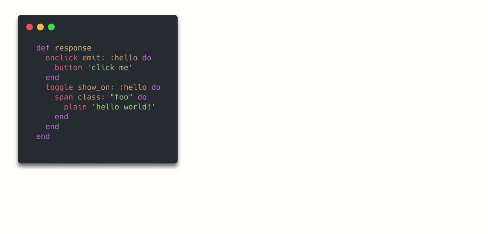
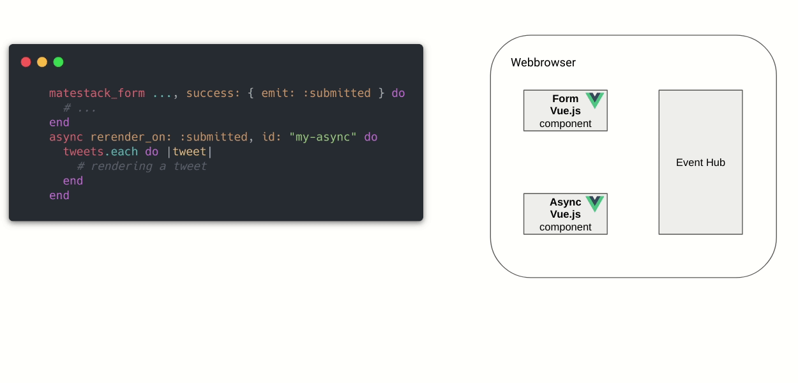

# Concepts & Rails Integration

**Matestack enables you to build beautiful reactive web UIs on top of Rails in pure Ruby**! ...how does that work? We somehow need HTML, JavaScript and CSS in order display a beautiful reactive web UI in a web browser. But Matestack provides a new approach which helps you to master these layers in pure Ruby:


Based on a strong foundation - Rails with all the sugar you love - Matestack enables you...

1. to implement HTML structures in pure Ruby \[matestack-ui-core\]
2. to compose pre-built reactive components based on Vue.js in pure Ruby \(extendable with custom JavaScript if required\) \[matestack-ui-core\]
3. to compose pre-built or custom styled components in pure Ruby _\*\*_\[e.g. matestack-ui-bootstrap\]

**which leads to beautiful reactive web UI implemented in pure Ruby:**


yielding following advantages:

* [x] Use Ruby’s amazing language features while creating your UI
* [x] Skip using templating engine syntax and write pure Ruby instead
* [x] Reduce the amount of required JavaScript in order to build reactive web UIs
* [x] Create a single application, managing the full stack from database to a reactive UI in pure Ruby
* [x] **Drastically reduce the complexity of building reactive web applications** 


You might want to use your own styles or even pre-built styled components matching the design system of your app instead of using Bootstrap's design system. Go for it mate! You can use all kind of styling approaches on top of `matestack-ui-core` !


Let's review the separate layers a little bit:

## HTML Structures implemented in pure Ruby

Matestack’s rendering mechanism takes care of converting Ruby into HTML using the core component library. `div`, `span` and `plain` are actually Ruby method calls mapped to a core rendering mechanism responsible for rendering simple HTML tags. `matestack-ui-core` supports all known HTML tags enabling you to build a well known DOM structure while writing and utilizing pure Ruby!

Think of the DOM structure required for a Bootstrap card component:

```markup
<div class="card shadow-sm border-0 bg-light">
  
  <div class="card-body">
    <h5 class="card-title">foo</h5>
    <p class="card-text">bar</p>
  </div>
</div>
```

and now watch the same structure implemented in Ruby:

```ruby
div class: "card shadow-sm border-0 bg-light" do
  img path: "...", class: "w-100"
  div class: "card-body" do
    h5 "foo", class: "card-title"
    paragraph "bar", class: "card-text"
  end
end
```

We're now using pure Ruby in order to create well known HTML structures without any abstraction. Still as flexible as pure HTML but we're now able to use all kind of Ruby's language features in order to structure our UI implementation!

Learn more about Matestack's HTML rendering:



But let's see where to put this code first:


```ruby
class Components::CardComponent < Matestack::Ui::Component

  def response
    div class: "card shadow-sm border-0 bg-light" do
      img path: "...", class: "w-100"
      div class: "card-body" do
        h5 "foo", class: "card-title"
        paragraph "bar", class: "card-text"
      end
    end
  end

end
```


We put this code in a self contained Ruby class which we call a **Matestack component.** When a new instance of this class is called, the main response method will return the desired HTML string. Within this Ruby class, we're now able to simply break out of deeply nested HTML structures and create a flat implementation. We end up splitting UI code into small semantically separated chunks.

Doing this we increase readability and maintainability of our implementation:


```ruby
class Components::CardComponent < Matestack::Ui::Component

  def response
    div class: "card shadow-sm border-0 bg-light" do
      img path: "...", class: "w-100"
      body_partial # calling the below defined instance method
    end
  end

  private

  def body_partial
    div class: "card-body" do
      h5 "foo", class: "card-title"
      paragraph "bar", class: "card-text"
    end
  end

end
```


**That’s just a very simple example. Can you imagine how powerful that is when working on complex UIs?**You can use all kinds of Ruby’s language features to craft your HTML structure! Think of shared modules, class inheritance or even meta-programming!

In order to make our component reusable, we define a component API and use injected content like this:


```ruby
class Components::CardComponent < Matestack::Ui::Component

  required :title
  optional :image_path, :content

  def response
    div class: "card shadow-sm border-0 bg-light" do
      img path: context.image_path, class: "w-100" if context.image_path
      body_partial
    end
  end

  private

  def body_partial
    div class: "card-body" do
      h5 context.title, class: "card-title"
      paragraph context.content, class: "card-text" if context.content
    end
  end

end
```


Components may take blocks or even named slots as well, making them even more flexible!

Learn more about components:



But how to integrate this class in a Rails app?

* You can use Matestack components on Rails views
* Or you can use Matestack components on Matestack pages

**Using a Matestack Component on a Rails view:**


```markup
<div class="row">
  <% @products.each do |product| %>
    <div class="col-md-3">
      <%= Components::Card.(
        title: product.name, 
        content: product.description
      ) %>
    </div>
  <% end %>
</div>
```


We simply call our component class and pass in required and optional parameters: in this case title and content coming from a ActiveRecord instance.

**Using a Matestack Component on a Matestack page:**

Alternatively **\*\*we substitute the Rails view with a** Matestack page\*\* and call the component there:


```ruby
class Pages::ProductOverview < Matestack::Ui::Page

  def response
    div class: "row" do
      products.each do |product|
        div class: "col-md-3" do
          Components::Card.(
            title: product.name, 
            content: product.description
          )
        end
      end
    end
  end

  private

  def products
    Product.last(10) # simple example of using helper methods in your response
  end

end
```


In order to integrate this Matestack page into Rails, we're simply telling a Rails controller NOT to render a Rails view, but a Matestack page instead. Matestack can progressively replace or live side by side with the UI layer of Rails - all other concepts like Routing, controller based authentication or authorization and so on stay untouched!


```ruby
class ProductsController < ApplicationController

  include Matestack::Ui::Core::Helper

  def overview
    render Pages::ProductOverview # reference the Page class here
  end

end
```


Learn more about Pages:



That's how we implement HTML structures in pure Ruby and integrate Matestack into Rails! Let's talk about some reactivity!


But wait: `matestack-ui-core` can be used without any JavaScript involved! The following description of Matestack's Vue.js Integration is optional. You can combine the described HTML rendering with multiple other reactivity systems **or none** if you want!


## \(Pre-built\) reactive components composed in pure Ruby

`matestack-ui-core` provides a Vue.js integration enabling you to compose pre-built reactive components \(Built-in reactivity\) or custom Vue.js components \(Custom reactivity\) in pure Ruby.

In both cases the Vue.js component content \(template\) is rendered through the above described HTML rendering approach and than additionally associated with a Vue.js component \(via a special \`&lt;component&gt;\` HTML tag and its attributes\)

### Built-in reactivity

90 % of required reactivity in a typical web app is based on similar patterns:

* Dynamic page transitions
* Dynamic form submissions and server side validation display
* Dynamically calling server side action
* Partial UI updates without browser reload
* View state toggling on user interactions
* Syncing multiple clients and let the react to server side events
* ...

Why reimplementing these generic features in JavaScript all the time? Why not build and maintain these features once and reuse them across all your apps? Can you imagine how much JavaScript implementation and maintenance can be avoided this way? Wouldn't that be cool?

Well, `matestack-ui-core` ships a growing library of pre-built reactive components implemented with Vue.js serving exactly that purpose: Enable you to skip the JavaScript implementation and focus on real Ruby business logic implementation!

Let's review the simplest two of these pre-built reactive components and toggle the view state on client side events using the `toggle` and `onclick` component:

Imagine this simple use case: You want to click somewhere on the UI and want to toggle the view state somewhere else on the UI. In a Matestack class response, you just call Ruby methods like `onclick` and `toggle` and pass in required options like `emit: :hello` or `show_on: :hello` and a block like `button 'click me'` or `span ...`‌



These methods are calling the pre-built reactive core components which are associated with a Vue.js JavaScript counterpart. The response method of a component or page class returns an HTML string. Each Vue.js component reference, in this case `onclick` and `toggle` triggers the rendering of a special HTML `<component>` tag containing the configuration hash as tag attributes \(e.g `emit: hello`\) and the given block as the inner HTML \(e.g. `button 'click me'`\)

When this HTML is parsed by Vue.js in the browser, the referenced Vue.js components, which are included in Matestack’s JavaScript are mounted and get the configuration hash injected. The inner HTML is treated as the components template. We then have two Vue.js component up and running in the browser! Additionally an event hub is mounted which enables communication between all components.

In the above shown example we defined an UI which will show a button and when that button is clicked the event “hello” is emitted and then received from the `toggle` component which will show its content, in this case a span containing a string “hello world”

Thanks to specific configurations and specific blocks you can adjust the behavior and the look of the pre-built reactive components according to your needs.

And that’s true for all pre-built components doing **way more complex** things for you:

**What about submitting a reactive form and perform a partial UI Update with server side rendered content afterwards without a browser reload...implemented in a few lines of Ruby?**



Sounds interesting? Following sections are diving deeper on these topics:















Matestack invites you to shift your mindset: Instead of implementing reactive features and taking care of Frontend/Backend dataflow with JavaScript yourself, use Matestack’s growing component library and let them do the work for you! **The work of implementing JavaScript is already done!**

But if you really need custom reactivity what can not be build with the built in components, simply add your own Vue.js components and let them live side by side with the built-in ones:

### Custom reactivity

Just like the pre-built custom components shipped within `matestack-ui-core`, your custom reactive components require two files: A Ruby file defining the class and the template of the component and an associated Vue.js JavaScript file, containing pure Vue.js code:


```ruby
class Components::MyVueJsComponent < Matestack::Ui::VueJsComponent

  vue_name "my-vue-js-component"

  def response
    div class: "my-vue-js-component" do
      button "click me", "@click": "increaseValue"
      br
      plain "{{ dynamicValue }}!"
    end
  end

end
```



```javascript
Vue.component('my-vue-js-component', {
  mixins: [MatestackUiCore.componentMixin],
  data: () => {
    return {
      dynamicValue: 0
    };
  },
  methods: {
    increaseValue(){
      this.dynamicValue++
      MatestackUiCore.eventHub.$emit("some_event")
    }
  }
});
```


The Vue.js file needs to be imported in your application pack js via Webpacker for example. In this file, you can do whatever JavaScript and Vue.js \(including Vuex\) has to offer. Additionally you can call Matestack's JavaScript APIs like the eventHub shown in the example. Through these APIs, your custom components may interact with all other Vue.js components, either custom or built-in ones!

The following example shows, how to use your custom Vue.js component on Matestack pages or components:

```ruby
class SomePage < Matestack::Ui::Page

  def response
    Components::MyVueJsComponent.() # or an alias method if you define one
    toggle show_on: :some_event do 
      span "triggered through custom Vue.js component"
    end
  end

end
```

Using this approach you are able to fill up the last 10% of custom reactivity your app might need it \(or even not!\) Do you realize how much JavaScript hustle can be avoided using Matestack’s built-in reactivity system while still being completely flexible?

**That’s what we call flexible abstraction!**



## \(Pre-built\) styled components composed in pure Rub**y**

How much do you enjoy copy&pasting complex DOM structures and giant chains of CSS classes across your APP in order to create a decent looking UI?

Do you remember the Bootstrap card component example from earlier? Wouldn’t it be cool to have all Bootstrap components available like that in pure Ruby?

That's at least what we thought and why we've created `matestack-ui-bootstrap`shipping all you need to build beautiful, reactive UIs in pure Ruby and smart CRUD components based on Bootstrap v5. Don't think about styling anymore and just create admin or application UIs faster than ever before!

So a card would be implemented like that:

```ruby
bs_card title: "foo", body: "bar"
```

which renders:

```markup
<div class="card">
  <div class="card-body">
    <h5 class="card-title">foo</h5>
    <p class="card-text">bar</p>
  </div>
</div>
```

Based on `matestack-ui-core` and `matestack-ui-bootstrap` this reactive dummy app was created in pure Ruby without writing any JavaScript, ERB/HAML/SLIM and CSS: \([check it out](https://dummy.matestack.io) \| [source code](https://github.com/matestack/matestack-ui-bootstrap/tree/main/spec/dummy)\)



**You want to learn more?**`matestack-ui-bootstrap` is a separate Gem and documented here: **\*\*\[**[https://matestack.gitbook.io/matestack-ui-bootstrap\*\*\]\(https://matestack.gitbook.io/matestack-ui-bootstrap/](https://matestack.gitbook.io/matestack-ui-bootstrap**]%28https://matestack.gitbook.io/matestack-ui-bootstrap/)\)


