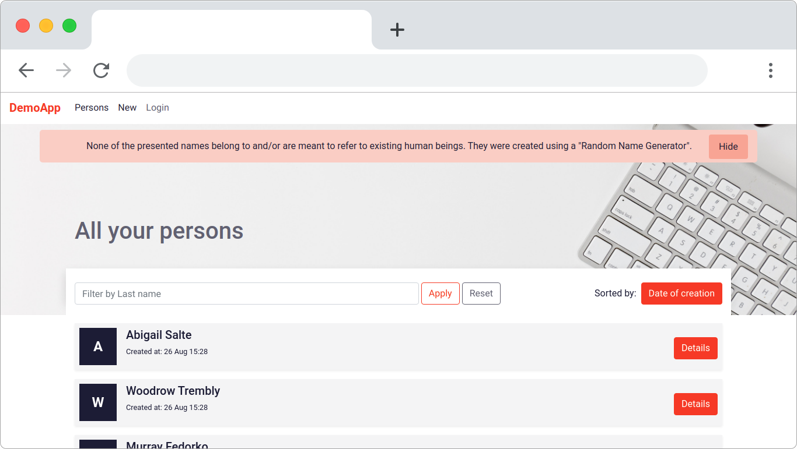

# Tutorial

In this series of guides we teach you how to create a rails app from the ground up with matestack and encounter how matestack makes your life easier and takes away the frontend hustle. We build a demo CRUD application which you can take a look at [here](https://demo.matestack.io) or checkout the below screenshot to get an idea of what we build. The source code of the complete application can be found on [github](https://github.com/matestack/matestack-demo-application).

Get started by reading the [introduction](/docs/reactive_apps/1000-tutorial/00_introduction.md).

## Table of contents

1. [Introduction](/docs/reactive_apps/1000-tutorial/00_introduction.md)
2. [Setup](/docs/reactive_apps/1000-tutorial/01_setup.md)
3. [Active Record](/docs/reactive_apps/1000-tutorial/02_active_record.md)
4. [Index, Show, Transition](/docs/reactive_apps/1000-tutorial/03_index_show_transition.md)
5. [Forms, CRUD](/docs/reactive_apps/1000-tutorial/04_forms_edit_new_create_update_delete.md)
6. [Toggle Component](/docs/reactive_apps/1000-tutorial/05_toggle_component.md)
7. [Async Component](/docs/reactive_apps/1000-tutorial/06_async_component.md)
8. [Partials and Custom Components](/docs/reactive_apps/1000-tutorial/07_partials_and_custom_components.md)
9. [Collection Component](/docs/reactive_apps/1000-tutorial/08_collection_async.md)
10. [Custom Vue.js Components](/docs/reactive_apps/1000-tutorial/09_custom_vue_js_components.md)
11. [Styling and Notifications](/docs/reactive_apps/1000-tutorial/10_styling_notifications.md)
12. [Authentication with Devise](/docs/reactive_apps/1000-tutorial/11_authentication_devise.md)
13. [Wrap Up](/docs/reactive_apps/1000-tutorial/12_wrap_up.md)
14. [Heroku Deployment](/docs/reactive_apps/1000-tutorial/13_heroku_deployment.md)

Above screenshot shows the startpage of our application which we will create together in this tutorial.